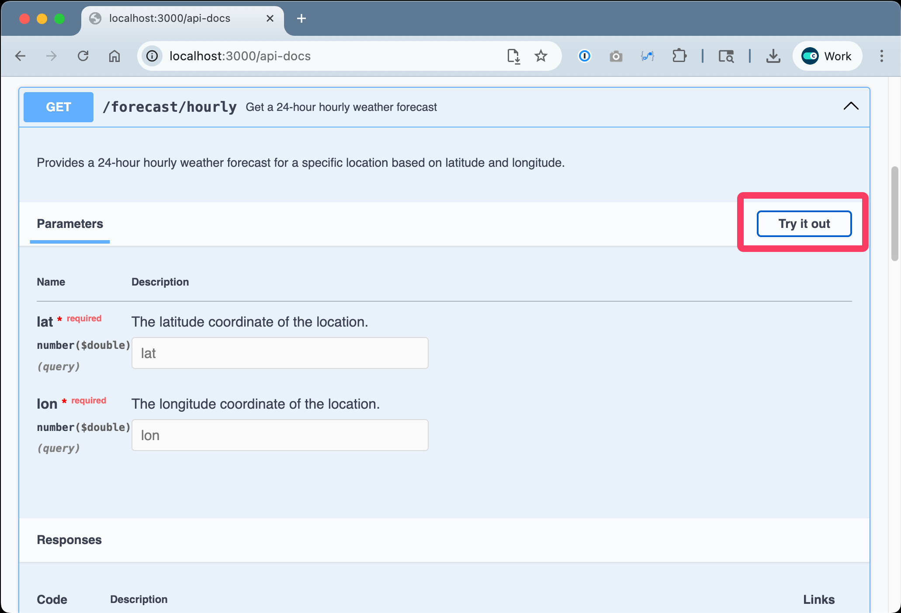
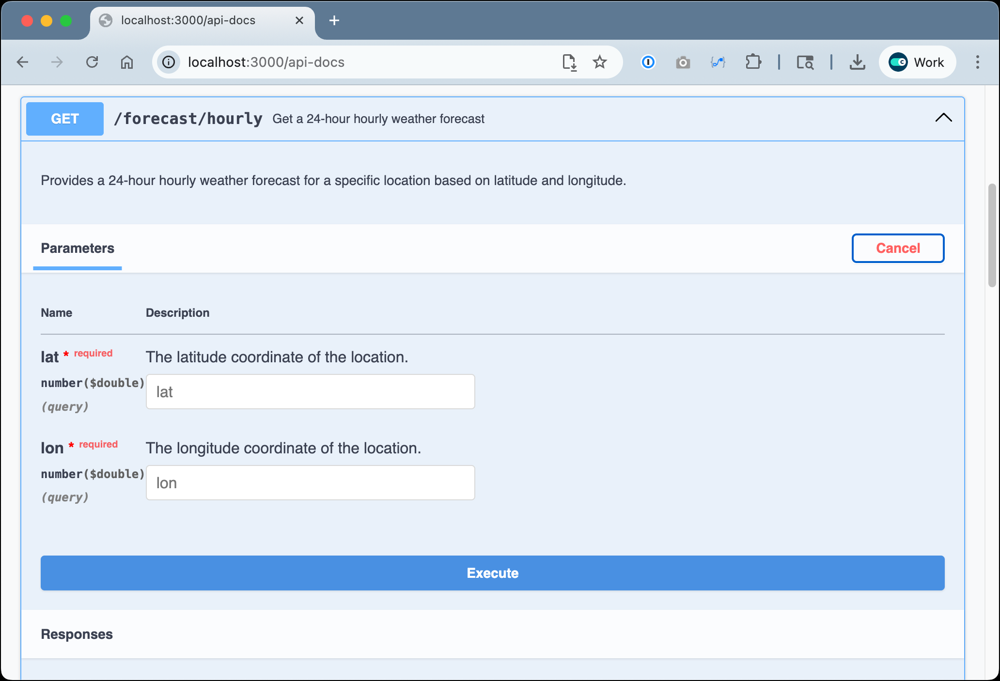

# Hands-On Guide

## Exercise 3: Feature - Generate API Code

### **Goal**

To generate the API code and unit tests for the hourly forecast feature.
 

### **Steps**

1. Create a new chat session, selecting “**Keep & Continue**” when asked.

2. Open the `implementation-plan/PHWF-xxx.md` implementation plan file.

3. Start entering the following command into the Chat window, select the command from the menu, and hit **Enter:**  
   > _Implement this plan_

4. Review the generate code and unit tests, and edit as required.

5. Enter the following prompt into the Chat window:

   > _Ensure that all unit tests have at least 90% coverage by running `pnpm test:unit`_

6. If the unit test coverage is less than 90% across all files, work with Copilot to update the unit tests.

   Follow the on-screen prompts, answering Copilot's questions as they arise.

7. To see the API in action, open [http://localhost:3000/api-docs/](http://localhost:3000/api-docs/) in your browser and:
   - Click on to _**GET /forecast/hourly**_ to expand the endpoint.

      

   - Click the _**Try it out**_ button.

   - Enter a _**lat**_ of `40.7128` and a _**lng**_ of `74.0060`.

   - Click the _**Execute**_ button.

      

### **Outcome**

You'll see the _**Hourly Forecast API**_ successfully implemented.
 

### **Next**

* [Exercise 4: Feature - Validate Acceptance Criteria Met](exercise-4_validate-acceptance-criteria-met.md)

