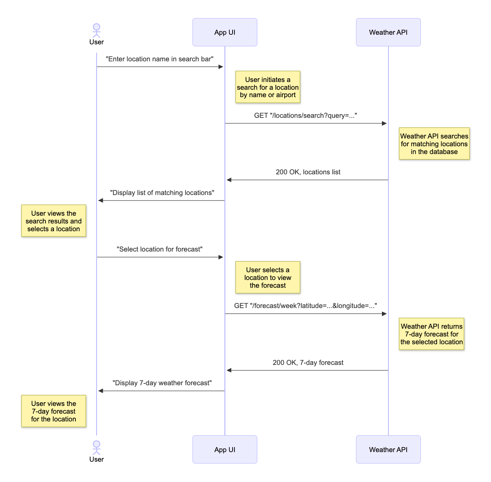

# Hands-On Guide

## Exercise 6: Diagram - Sequence Diagram

### **Goal**

To generate a sequence diagram for a user flow.
 

### **Steps**

1. Create a new chat session, selecting “**Keep & Continue**” when asked.

2. In the left-hand side _**EXPLORER**_ pane, right-click on the `/spec/swagger.yaml` file and select _**Copilot > Add File to Chat**_.

3. Enter the following prompt into the Chat window and hit **Enter**:

   > `/sequence-diagram` _Show a diagram where the user search for a location within the app, finds it, then requests a 7 day forecast for that location._

4. A new file will be generated in the  `/diagrams` folder. and automatically displayed.

   - If the diagram is not automatically displayed, ensure that you have the [Mermaid Preview Extension](https://marketplace.visualstudio.com/items?itemName=vstirbu.vscode-mermaid-preview) installed.

   - Open the diagram file, right-click within the body of the file, and select _**Preview Diagram**_.

   

### **Outcome**

You'll see a sequence diagram has been created for the user flow.
 

### **Next**

* [Exercise 7: Refactor Code](exercise-7_refactor-code.md)

