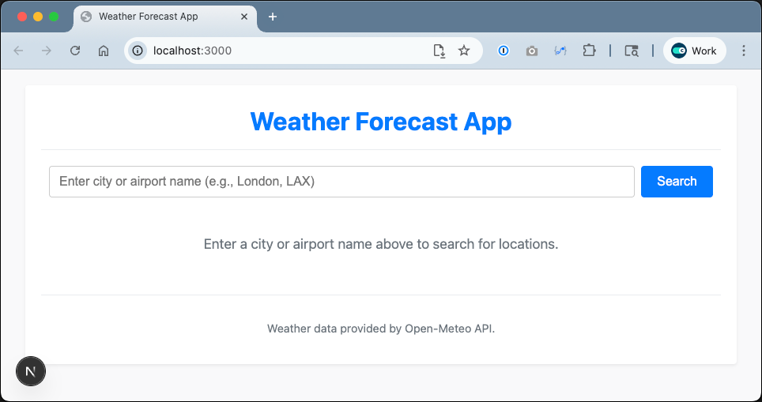

# Hands-On Guide

## Step 0. Setup the application using the Copilot Agent

Throughout these exercises, you'll be using the [**Copilot Agent Mode**](https://code.visualstudio.com/blogs/2025/02/24/introducing-copilot-agent-mode).

### **Goal**

To setup the sample Next JS Weather Application, and get it running, using the **Copilot Agent Mode**.

### **Steps**

1. Open the `github-copilot-training` folder in VS Code
2. If prompted, install the following recommended extensions:
    - [Jest](https://marketplace.visualstudio.com/items?itemName=Orta.vscode-jest) 
    - [Mermaid Preview](https://marketplace.visualstudio.com/items?itemName=vstirbu.vscode-mermaid-preview)
    - [SonarQube for IDE](https://marketplace.visualstudio.com/items?itemName=SonarSource.sonarlint-vscode)

3. Open the GitHub Copilot chat window and select the **Agent** chat mode and the **GPT-4.1** model.  
4. Open the `README.md` file.  
5. Enter the following prompt into the Chat window and hit **Enter**:

    > _Check for and install the necessary application dependencies and then start the development server in a background terminal._

6. Follow the on-screen prompts, answering Copilots questions as they arise.  
7. Once the server has been successfully started open the following link in a web browser:

    [http://localhost:3000](http://localhost:3000)

### **Outcome**

You'll see the sample weather app in your browser.

### **Next**

* [Step 1: Generate User Stories](step-1_generate-user-stories.md)