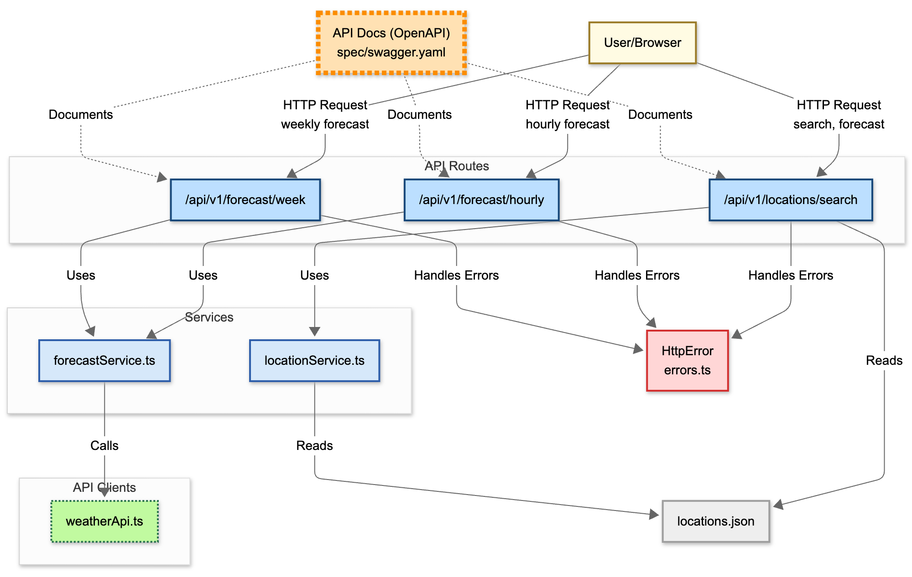

# Hands-On Guide

## Step 5. Diagram: Logical Architecture Diagram

### **Goal**

To generate a logical architecture diagram for the application.
 

### **Steps**

1. Create a new chat session, selecting “**Keep & Continue**” when asked.

2. In the left-hand side _**EXPLORER**_ pane, right-click on the `src` folder and select _**Copilot > Add Folder to Chat**_.

3. Start entering the following command into the Chat window, select the command from the menu, and hit **Enter:**  

   > `/logical-architecture-diagram`   

4. A file named `/diagrams/logical-architecture-diagram.mmd` will be generated. and automatically displayed.

   - If the diagram is not automatically displayed, ensure that you have the [Mermaid Preview Extension](https://marketplace.visualstudio.com/items?itemName=vstirbu.vscode-mermaid-preview) installed.

   - Open the diagram file, right-click within the body of the file, and select _**Preview Diagram**_.

   

### **Outcome**

You'll see a logical architecture diagram has been generated for the application.
 

### **Next**

* [Step 6: Diagrams - Sequence Diagram](step-6_sequence-diagram.md)

